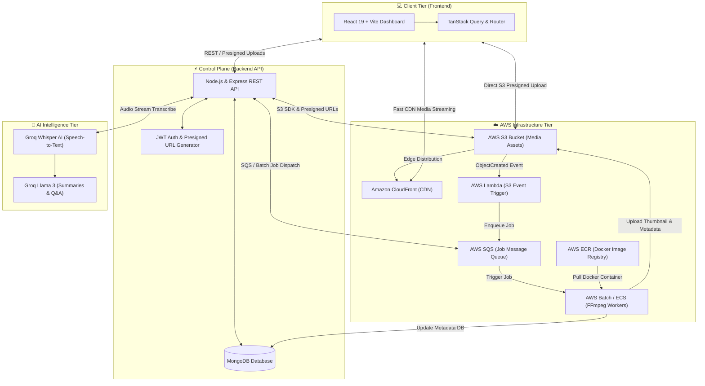
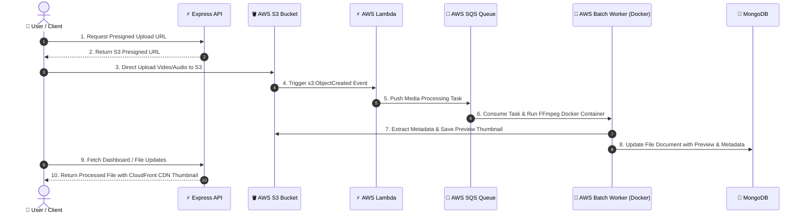

# ☁️ CloudVault — Cloud-Native Architecture Diagrams

> Designed & Created by **Lokesh**  
> GitHub: [lokeshsingh07](https://github.com/lokeshsingh07) · LinkedIn: [lokeshsingh07](https://linkedin.com/in/lokeshsingh07) · Contact: [codewithlokesh.com/contact](https://codewithlokesh.com/contact)

---

## 🏛️ Diagram 1: High-Level End-to-End System Architecture

This diagram illustrates the complete 4-tier architecture of **CloudVault**, highlighting the separation between the React 19 client, Node.js control plane, AWS serverless media pipeline, and Groq AI intelligence tier.

---

## ⚙️ Diagram 2: Asynchronous AWS Media Pipeline Flow

This sequence diagram details the event-driven workflow when a user uploads media to S3, triggering background Lambda events, SQS queuing, and AWS Batch containerized video processing.

---

## 🤖 Diagram 3: Groq AI Speech-to-Text & Insights Pipeline

This diagram shows how audio and video files undergo high-speed AI processing for speech transcription, summary generation, and interactive Q&A extraction.

```mermaid
flowchart LR
    subgraph Trigger ["1. Request Phase"]
        User["User Clicks Transcribe"]
        API["Express API Handler"]
        User --> API
    end

    subgraph Fetch ["2. Data Pipeline"]
        S3["AWS S3 Media Asset"]
        Stream["Audio Stream Extractor"]
        API --> S3
        S3 --> Stream
    end

    subgraph Groq ["3. Groq AI Processing Engine"]
        Whisper["Groq Whisper API\n(Fast Speech-to-Text)"]
        Llama["Groq Llama 3 LLM\n(Summary, Key Points & Q&A)"]
        Stream --> Whisper
        Whisper -->|"Raw Transcript"| Llama
    end

    subgraph Persist ["4. Persistence & Presentation"]
        DB[(MongoDB Document)]
        UI["React 19 AI Insights Tab"]
        Llama -->|"Structured AI Result"| DB
        DB --> UI
    end
```

---

### 💡 LinkedIn Caption Idea for Lokesh:
> 🚀 Excited to share the architecture of **CloudVault** — cloud media vault & AI transcription platform!
> 
> ⚡ **Tech Stack**:
> - **Frontend**: React 19, Vite, Tailwind CSS, TanStack Query/Router
> - **Backend**: Node.js, Express, MongoDB, JWT
> - **Cloud & Serverless**: AWS S3, CloudFront CDN, AWS Lambda, AWS SQS, AWS Batch (Docker on ECR)
> - **AI Engine**: Groq AI (Whisper Speech-to-Text & Llama 3)
> 
> Check out the project on GitHub: https://github.com/lokeshsingh07
> Portfolio & Contact: https://codewithlokesh.com/contact
